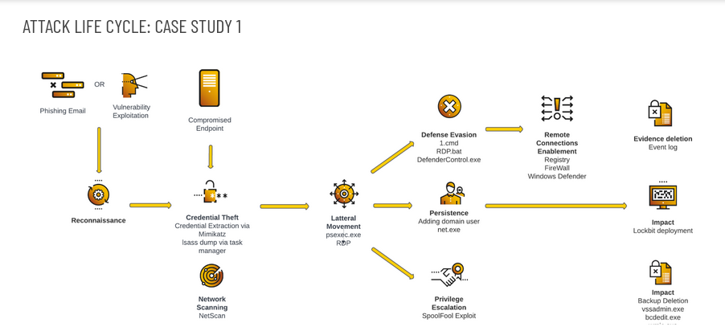

## How LockBit Ransomware Works

The LockBit ransomware behaves similarly to the “LockerGoga & MegaCortex” malware family. It, therefore, follows these phases in its operation;

### Exploitation

The initial breach of LockBit ransomware appears similar to prior harmful assaults. It may utilize social engineering strategies such as phishing, in which attackers mimic trusted persons or authority to get access credentials. Brute force assaults on an organization’s intranet servers and network systems are also feasible options. Attack probes may only take a few days to finish if the network is not correctly configured.After LockBit has made it inside a network, the ransomware prepares the system to unleash its encrypting payload across every device it can. Yet, an attacker may need to complete a few more steps before making their ultimate move.

### Infiltration

From this point on, the LockBit script is in charge of all activities. It is designed to leverage “post-exploitation” methods to escalate privileges and attain an attack-ready degree of access. It also roots through access accessible through lateral movement to assess target viability. LockBit will take any necessary precautions before distributing the encryption element of the ransomware. This includes turning off security programs and any other infrastructure allowing system recovery. The purpose of infiltration is to make unaided recovery impossible or so sluggish that paying the attacker’s ransom is the only viable option. When the victim is desperate to resume regular operations, they will pay the ransom money.
    
## Deployment

After the network has been adequately prepped for LockBit, the ransomware will begin spreading to each system it can touch. As previously said, LockBit does not require much to finish this step. A single system unit with elevated access can send orders to other network units to download and run LockBit. All system files will be “locked” throughout the encryption process. Only a specific key generated by LockBit’s proprietary decryption program may be used to unlock victims’ PCs. In addition, copies of a basic ransom note text file are left in each system folder. It gives the victim instructions on recovering their system and has even contained blackmail threats in some LockBit versions.

